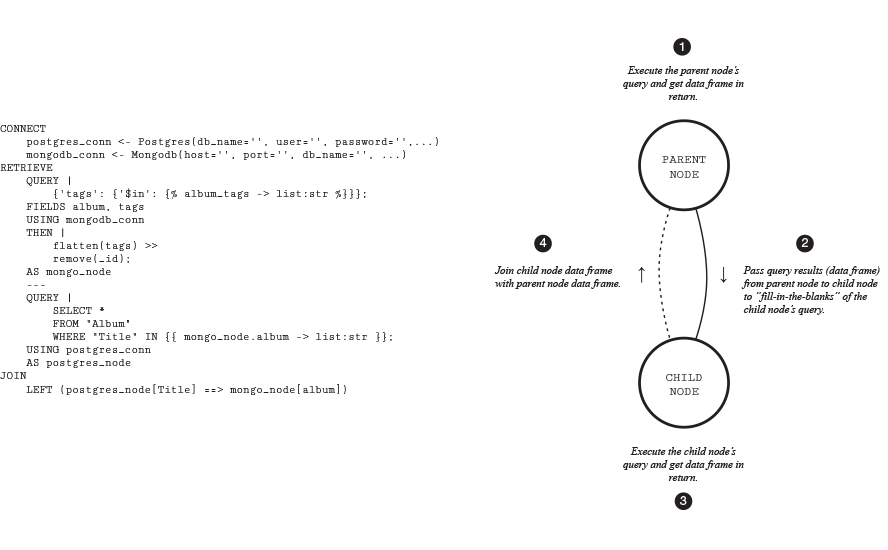

***

Query Graph is a framework/language, written in Python, for joining data 
from different database management systems - i.e. joins that can't 
typically be accomplished with a single query. For example, joining 
Postgres data and Mongo Db data. It also provides tools for easily 
converting non-tabular data (e.g. JSON) into tabular form.

The following databases are currently supported:

* Sqlite
* MySQL
* Postgres
* Mongo Db
* Elastic Search
* Apache Cassandra (untested)
* Maria Db (untested)
* InfluxDB (untested)
* MS Sql (untested)

## Main Features

* Join data from any number of different database types in a single query.
* Manipulate data using "manipulation sets", which are chained together
  statements very similar to those used in the `dplyr` package for R.
  ```
  mutate(new_col=log(old_col)) >>
  remove(some_column)
  ```
* Easily transform JSON-like data into relational form.
* Threading can optionally be used to run queries on different databases
  simultaneously, based the structure of the query graph.

## Getting Started

* To install Query Graph, see below.
* For a brief introduction to Query Graph, see here.
* For a more complete introduction, see here.
* For documentation, see here.

## Installation

To install Query Graph...

## Query Graph Language - Brief Introduction

Query Graph Language (QGL) is a simple, domain specific declarative 
language. A QGL query consists of three primary "blocks": the `CONNECT` 
block, the `RETRIEVE` block, and the `JOIN` block.

The `CONNECT` block establishes connections with databases that will be
queried upon execution. The `RETRIEVE` block is where actual queries
on the databases - called "query nodes" - are defined, and the `JOIN` block
is for describing how the results of query nodes defined in the`RETRIEVE` 
block are joined. The diagram below shows the basic structure of each 
block using an example QGL query.

<hr style="height: 0.1em;">


<hr style="height: 0.1em;">

The example query above has two query nodes. Highlighted in red are each
of the query node's "query templates". A query template is simply a query
written in the appropriate language for the database system it is
intended for (e.g. SQL), augmented with "template parameters".

You'll see below that if the template parameters (highlighted in green)
are replaced, each query is valid for its respective database type 
(Mongo Db and Postgres). You'll note that a slightly different syntax is
used for each parameter - this is explained further on.

<hr style="height: 0.1em;">


<hr style="height: 0.1em;">

### Template Parameters

There are two different types of template parameters: "independent"
parameters, and "dependent" parameters. Both share the same basic
syntax, but have different open/close tags.

<hr style="height: 0.1em;">


<hr style="height: 0.1em;">

Independent parameters are rendered using values defined prior to a 
query graph being executed - they don't depend on the results of query
nodes. Dependent parameters, on the other hand, are rendered used values
from results of a given node's "parent node".

```python
df = query_graph.execute(my_param=6)
```


## Syntax Stuff

The basic building block of Query Graph are "query templates". A query
template is a query written in the appropriate form/language, given 
the type of database it is intended for (e.g. SQL), augmented with 
"template parameters".

A query graph is a directed, acyclic graph whose nodes each represent a
single query on a database. When two nodes are connected, the data 
resulting from the parent node's query is used to "fill-in-the-blanks" of
the child node's query.



### Example Query

___


```
CONNECT
    postgres_conn <- Postgres(db_name='%s', user='%s', password='%s', host='%s', port='%s')
    mongodb_conn <- Mongodb(host='%s', port='%s', db_name='%s', collection='%s')
RETRIEVE
    QUERY |
        {'tags': {'$in': }};
    FIELDS album, tags
    USING mongodb_conn
    THEN |
        flatten(tags) >>
        remove(_id);
    AS mongo_node
    ---
    QUERY |
        SELECT *
        FROM "Album"
        WHERE "Title" IN {{ album -> list:str }};
    USING postgres_conn
    AS postgres_node
JOIN
    LEFT (postgres_node[Title] ==> mongo_node[album])
```

## Query Graph Language

A QGL query consists of three primary 'blocks': the `CONNECT` block, 
the `RETRIEVE` block, and the `JOIN` block. The `CONNECT` block 
established database connections, the `RETRIEVE` block creates query
nodes, and the `JOIN` describes how the nodes are joined.


### Connect Block

Each connector in the `CONNECT` block points a name to a database
type and associated credentials. The railroad diagram below outlines
the syntax.


### Retrieve Block

The `RETRIEVE` block defines the graph's query nodes.


### Join Block

The `JOIN` block defines how the graph's query nodes are joined.

